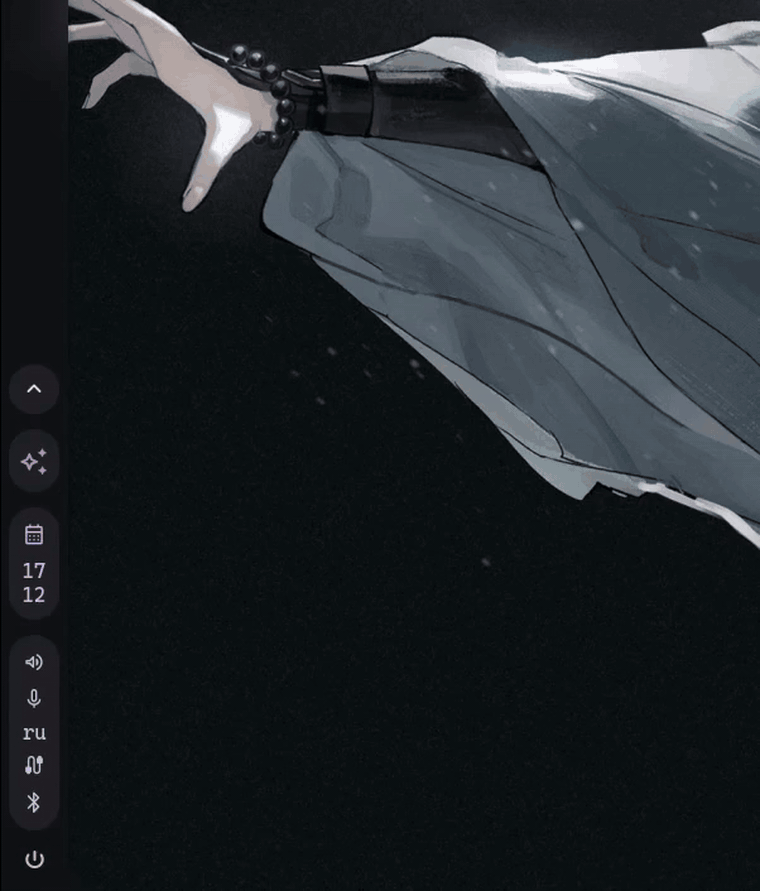

# caelestia-ai

An animated AI popout and quick prompt blob for the Caelestia Quickshell desktop.

## Demo

<p align="center">
  
</p>

<p align="center">
  
</p>

`caelestia-ai` adds an AI button to the Caelestia bar, a full chat popout, and a centered `caelestia-blob` prompt window that can be opened from a keybind.

## Features

- Bar AI button with animated idle/thinking icon.
- Full AI chat popout with chat history, model picker, reasoning toggle, attachments, Markdown-ish rendering, code blocks, shell/tool blocks, copy actions, and voice input.
- Center-screen prompt blob for quickly asking a question without opening the full chat.
- Shared state between blob and popout: draft text, selected chat, selected model, backend, and sent messages are synchronized.
- OpenCode backend for normal chats and provider/model selection.
- Optional direct Google API backend with separate API chats.
- Optional local speech-to-text through `whisper.cpp`.
- Optional Telegram forwarding script for bot-style replies.
- Prompt trigger symbols: normal, `>`, `@`, `$`, and `<`.

## Project Layout

```text
quickshell/                 Files copied into ~/.config/quickshell/caelestia
quickshell/modules/...      AI popout, blob, bar integration, drawer integration
quickshell/services/...     OpenCode/API state service and speech-to-text service
quickshell/scripts/...      OpenCode bridge, Google API bridge, Telegram bridge, Whisper bridge
bin/caelestia-blob          CLI trigger for the center blob
config/*.example.*          Example local configs
prompts/*.md                Example prompt files
scripts/install.sh          Simple file-copy installer
docs/what-was-changed.md    Manual integration notes
```

## What The Installer Does

`scripts/install.sh` is intentionally simple. It does not install system packages, does not edit your shell config, and does not restart Quickshell.

It does this:

- Copies everything from `quickshell/` into `~/.config/quickshell/caelestia/`.
- Installs `bin/caelestia-blob` to `~/.local/bin/caelestia-blob`.
- Creates `~/.config/caelestia-ai/.env` from `.env.example` if it does not exist.
- Creates `~/.config/caelestia-ai/api-config.json` from `config/api-config.example.json` if it does not exist.
- Creates `~/.config/caelestia-ai/telegram.env` from `config/telegram.example.env` if it does not exist.
- Creates prompt files in `~/opencode/prompts/` if they do not exist.

If your Caelestia config is heavily customized, read `docs/what-was-changed.md` before running the installer and merge manually instead.

## Dependencies

### Required

- Linux desktop using Caelestia Quickshell.
- Hyprland/Quickshell environment compatible with Caelestia.
- `bash`
- `python`
- `curl`
- OpenCode CLI

### Required For Direct Google API Backend

- Python packages from `requirements.txt`:

```bash
python -m pip install -r requirements.txt
```

For an isolated environment:

```bash
python -m venv ~/.local/share/caelestia-ai/venv
~/.local/share/caelestia-ai/venv/bin/pip install -r requirements.txt
```

If you use a venv, update the shebang or command path for `quickshell/scripts/google-api-bridge.py`, or make sure `google-genai` and `python-dotenv` are available to the default `python3`.

### Required For Voice Dictation

- `ffmpeg`
- PulseAudio/PipeWire Pulse compatibility
- `whisper.cpp`
- Whisper base model file

On Arch:

```bash
sudo pacman -S --needed git cmake make gcc ffmpeg python python-pip curl
```

Package names differ on other distributions, but you need the same tools.

## Install OpenCode

Install OpenCode first and make sure it works from a terminal.

Official install command:

```bash
curl -fsSL https://opencode.ai/install | bash
```

Then run:

```bash
opencode
```

Set up your OpenCode providers/models normally inside OpenCode. The module reads enabled models from OpenCode and shows them in the picker.

Useful files this module reads:

```text
~/.config/opencode/opencode.json
~/.config/ai.opencode.desktop/opencode.global.dat.json
```

## Install The Module

Clone this repository and run:

```bash
./scripts/install.sh
```

Then restart Quickshell manually:

```bash
pkill quickshell
quickshell -c caelestia &
```

If you use a different Caelestia config path:

```bash
QS_CAELESTIA_DIR=/path/to/caelestia ./scripts/install.sh
```

If you want local module config somewhere else:

```bash
CAELESTIA_AI_CONFIG_DIR=/path/to/config ./scripts/install.sh
```

## Configure Google API Backend

The API backend is optional. The OpenCode backend works without it.

Create local config:

```bash
mkdir -p ~/.config/caelestia-ai
cp .env.example ~/.config/caelestia-ai/.env
cp config/api-config.example.json ~/.config/caelestia-ai/api-config.json
```

Edit:

```text
~/.config/caelestia-ai/.env
```

Example:

```env
GOOGLE_API_KEY=your-google-api-key
```

Edit models here:

```text
~/.config/caelestia-ai/api-config.json
```

Example model entry:

```json
{
  "id": "api/gemma-4-31b-it",
  "label": "Gemma 4 31B",
  "provider": "api",
  "sdk_model": "gemma-4-31b-it",
  "enabled": true,
  "attachments": true,
  "reasoning": true,
  "variants": []
}
```

Fields:

- `id`: internal module ID. Keep the `api/` prefix.
- `label`: what appears in the model picker.
- `provider`: should be `api` for the Google API backend.
- `sdk_model`: model name passed to Google GenAI SDK.
- `enabled`: whether the model appears in the UI.
- `attachments`: whether image/file attachments are allowed for that model.
- `reasoning`: whether the UI should show the reasoning toggle for that model.
- `variants`: optional reasoning variants; leave empty unless you add custom support.

API chats are stored separately from OpenCode chats at:

```text
~/.local/state/caelestia/google-api-chats.json
```

## Configure Whisper Voice Input

Voice input uses local `whisper.cpp`. The default paths are:

```text
~/opencode/whisper.cpp/build/bin/whisper-cli
~/opencode/whisper.cpp/models/ggml-base.bin
```

Install:

```bash
mkdir -p ~/opencode
git clone https://github.com/ggml-org/whisper.cpp ~/opencode/whisper.cpp
cmake -S ~/opencode/whisper.cpp -B ~/opencode/whisper.cpp/build
cmake --build ~/opencode/whisper.cpp/build -j"$(nproc)"
bash ~/opencode/whisper.cpp/models/download-ggml-model.sh base
```

Test:

```bash
~/opencode/whisper.cpp/build/bin/whisper-cli \
  -m ~/opencode/whisper.cpp/models/ggml-base.bin \
  -f ~/opencode/whisper.cpp/samples/jfk.wav
```

If you keep Whisper somewhere else, set these environment variables before Quickshell starts:

```bash
export WHISPER_CLI_PATH=/custom/path/whisper-cli
export WHISPER_MODEL_PATH=/custom/path/ggml-base.bin
```

The module records temporary audio to:

```text
~/.local/state/caelestia/whisper/
```

## Configure Telegram Forwarding

Telegram forwarding is optional. It is used by the included `telegram-forward.sh` script.

Create config:

```bash
mkdir -p ~/.config/caelestia-ai
cp config/telegram.example.env ~/.config/caelestia-ai/telegram.env
```

Edit:

```text
~/.config/caelestia-ai/telegram.env
```

Example:

```env
TELEGRAM_BOT_TOKEN=your-bot-token
TELEGRAM_CHAT_ID=your-chat-id
```

If the file is missing or empty, Telegram forwarding simply does nothing.

The script converts a small subset of Markdown to Telegram HTML:

- `**bold**`
- `*italic*`
- `` `code` ``
- fenced code blocks

## Prompt Files And Trigger Symbols

Prompt files live in:

```text
~/opencode/prompts/
```

The installer creates example files:

```text
~/opencode/prompts/sys.md
~/opencode/prompts/special.md
~/opencode/prompts/special2.md
~/opencode/prompts/special3.md
~/opencode/prompts/bot.md
```

Trigger behavior:

- `message`: prepends `sys.md` if the file is not empty.
- `> message`: prepends `special.md`.
- `@ message`: prepends `special2.md`.
- `$ message`: prepends `special3.md`.
- `< message`: prepends `bot.md`.

The UI hides the prompt block from the visible user bubble, but the model still receives it.

## Hyprland Bind For The Blob

`caelestia-blob` opens the centered prompt window.

Add a bind to your Hyprland config:

```conf
bind = SUPER, SPACE, exec, caelestia-blob
```

Or pick another key:

```conf
bind = SUPER, A, exec, caelestia-blob
```

Restart/reload Hyprland config after adding the bind:

```bash
hyprctl reload
```

## Manual Integration Checklist

If you do not want to copy the whole `quickshell/` directory, merge these pieces manually.

Add AI bar entry:

```text
quickshell/config/BarConfig.qml
```

Add AI delegate:

```text
quickshell/modules/bar/Bar.qml
```

Add AI popout:

```text
quickshell/modules/bar/popouts/Content.qml
quickshell/modules/bar/popouts/Ai.qml
quickshell/modules/bar/components/Ai.qml
```

Add blob:

```text
quickshell/modules/blob/Content.qml
quickshell/modules/blob/Wrapper.qml
quickshell/modules/BlobIpc.qml
```

Add drawer integration:

```text
quickshell/components/DrawerVisibilities.qml
quickshell/modules/drawers/Drawers.qml
quickshell/modules/drawers/Panels.qml
quickshell/modules/drawers/Interactions.qml
```

Add services and scripts:

```text
quickshell/services/Opencode.qml
quickshell/services/SpeechToText.qml
quickshell/scripts/opencode-bridge.sh
quickshell/scripts/google-api-bridge.py
quickshell/scripts/whisper-bridge.sh
quickshell/scripts/telegram-forward.sh
```

More notes are in:

```text
docs/what-was-changed.md
```

## Troubleshooting

### The AI button does not appear

Check that `ai` exists in `Config.bar.entries` and that `Bar.qml` has a `DelegateChoice` for `roleValue: "ai"`.

### The popout opens but is clipped

Check your bar/drawer wrapper clipping settings. Some Caelestia layouts need popout containers to avoid clipping external popouts.

### OpenCode models are missing

Open OpenCode itself and confirm the models are enabled there. Then restart Quickshell.

### API models are missing

Check:

```text
~/.config/caelestia-ai/api-config.json
~/.config/caelestia-ai/.env
```

Run:

```bash
python ~/.config/quickshell/caelestia/scripts/google-api-bridge.py list-models
```

### Voice input does not work

Check:

```bash
command -v ffmpeg
test -x ~/opencode/whisper.cpp/build/bin/whisper-cli
test -f ~/opencode/whisper.cpp/models/ggml-base.bin
```

Then test the bridge:

```bash
bash ~/.config/quickshell/caelestia/scripts/whisper-bridge.sh status
```

### Telegram messages do not arrive

Check:

```text
~/.config/caelestia-ai/telegram.env
```

Then run:

```bash
bash ~/.config/quickshell/caelestia/scripts/telegram-forward.sh "test message"
```

## Credits

- Caelestia / Quickshell desktop environment.
- OpenCode terminal AI agent.
- `ggml-org/whisper.cpp` for local speech recognition.
